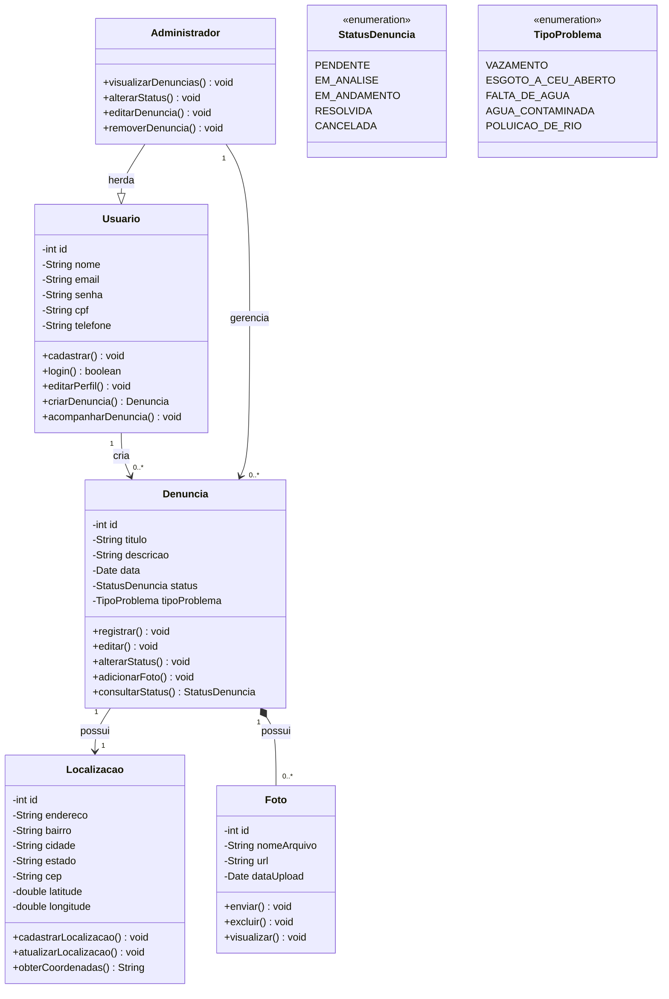

# Agua-Alerta
Esse é um projeto de faculdade feito em grupo, com a ideia de criar uma plataforma onde as pessoas possam denunciar problemas relacionados à água e ao saneamento, como vazamentos, falta de água e poluição.

## Diagrama de Classes

As classes do Água Alerta foram definidas com base nas principais funções do sistema. A classe **Usuário** representa as pessoas que utilizam a plataforma e podem registrar denúncias. A classe **Administrador** herda de Usuário e possui funções específicas para gerenciar as denúncias. A classe **Denúncia** representa os problemas registrados, enquanto **Localização** identifica onde o problema ocorreu e **Foto** permite anexar imagens à denúncia. As enumerações **StatusDenuncia** e **TipoProblema** foram criadas para definir, respectivamente, os possíveis estados da denúncia e os tipos de problemas que podem ser registrados. O sistema será inicialmente desenvolvido para atender uma cidade específica.

## Sobre o projeto

O **Água Alerta** é uma plataforma que permite que cidadãos denunciem problemas relacionados à água e ao saneamento básico em suas regiões. O objetivo é engajar a comunidade na identificação de falhas na infraestrutura e incentivar a busca por soluções junto aos órgãos responsáveis.

## Como funciona o registro de uma denúncia

O processo foi pensado para ser simples e rápido:

1. O usuário acessa o site e inicia a criação de um novo relato.
2. Informa os dados essenciais da ocorrência localização, descrição e fotos.
3. Envia o formulário para validação do sistema.
4. A denúncia é registrada publicamente na plataforma, ficando disponível para acompanhamento e engajamento da comunidade local.

## Informações registradas no sistema

Cada denúncia pode conter:

| Campo | Descrição |
|---|---|
| **Localização geográfica** | Endereço aproximado ou coordenadas do local afetado |
| **Tipo de ocorrência** | Classificação do problema (veja abaixo) |
| **Descrição detalhada** | Texto explicativo fornecido pelo usuário |
| **Evidências visuais** | Foto(s) do local para comprovação do problema |

**Tipos de ocorrência:**
-  Vazamentos de água
-  Esgoto a céu aberto
-  Água contaminada ou alteração na qualidade
-  Falta de água ou desabastecimento
-  Poluição de rios e mananciais

## O papel da Inteligência Artificial

A IA atua como triagem, validação e organização dos dados recebidos pela plataforma.

**Análise e classificação de denúncias**
- **Processamento de imagens:** analisa as fotos enviadas para confirmar se correspondem a vazamentos, esgoto, contaminação ou poluição, reduzindo envios incorretos ou spam.
- **Categorização automática de texto:** processa a descrição digitada pelo usuário e categoriza automaticamente a severidade e o tipo de problema.

**Por que a IA é fundamental**
- **Escalabilidade**:  processa centenas de relatos simultâneos sem travamento.
- **Priorização**:  identifica na hora as ocorrências de alto risco.
- **Organização de dados**:  padroniza as informações, facilitando a visualização em mapas de calor e relatórios comunitários.

## Escopo do MVP

Inicialmente, o MVP do Água Alerta atende:

- [x] Formulário funcional de cadastro de denúncia (localização, tipo de problema, descrição e upload de foto)
- [x] Classificação simples acionada por IA (validação do texto e análise inicial do tipo de problema/imagem)
- [x] Feed/lista de denúncias registradas, exibindo informações da comunidade e status do relato
