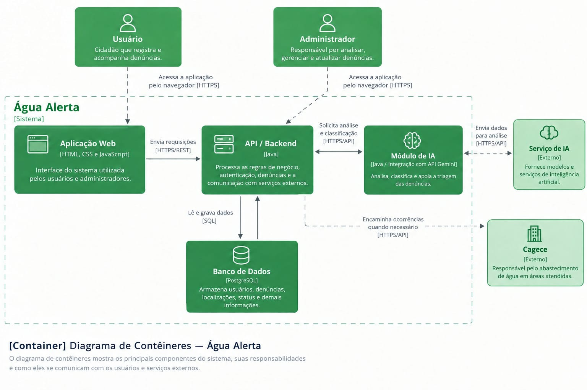

# Água Alerta — Diagrama de Contêineres

## Resumo da arquitetura

A ideia central é que o cidadão registre a ocorrência pela Aplicação Web, que envia os dados para a API/Backend em Java. A API armazena a denúncia no PostgreSQL e pode solicitar ao módulo de IA uma análise para auxiliar na classificação e triagem. Quando necessário, a ocorrência pode ser encaminhada ao responsável externo, como a Cagece. O administrador utiliza a mesma aplicação para analisar e acompanhar as denúncias.

## Motivo das tecnologias escolhidas
HTML: utilizado para estruturar as páginas e os elementos da aplicação web.
CSS: responsável pela aparência, organização e responsividade da interface.
JavaScript: utilizado para dar interatividade ao Front-end e realizar a comunicação com a API do sistema.
Java: escolhido para o Backend, responsável pelas regras de negócio, autenticação, processamento das denúncias e comunicação com o banco de dados e serviços externos. Também atende ao requisito de utilização de Java no projeto.
PostgreSQL: escolhido para armazenar os dados do sistema, como usuários, denúncias, localizações e status, oferecendo uma estrutura adequada para trabalhar com dados relacionados.
Gemini: escolhido como agente/serviço de IA por oferecer recursos de inteligência artificial que podem ser integrados ao sistema e utilizados para analisar e auxiliar na classificação das denúncias, além de possuir opções de uso gratuito dentro dos limites disponíveis.

Em conjunto, essas tecnologias permitem que o Água Alerta tenha uma aplicação web acessível, um backend responsável pelo processamento, um banco para persistência dos dados e uma IA para auxiliar na análise das denúncias.

# Diagrama C4 — Água Alerta

Este diagrama representa o **contexto do sistema Água Alerta** e suas principais interações.

O **Usuário/Cidadão** registra uma denúncia no sistema, enviando os dados da ocorrência. O **Água Alerta** encaminha esses dados para uma **IA externa**, responsável por analisar e classificar a denúncia.

Após a análise, a ocorrência é encaminhada aos **Órgãos Responsáveis**, que também são externos ao sistema e ficam responsáveis por analisar e solucionar o problema.

Durante o processo, os órgãos enviam atualizações ao Água Alerta, que repassa o **status da ocorrência ao usuário**, permitindo seu acompanhamento.

### Fluxo principal

**Usuário → Água Alerta → IA → Água Alerta → Órgãos Responsáveis → Água Alerta → Usuário**
